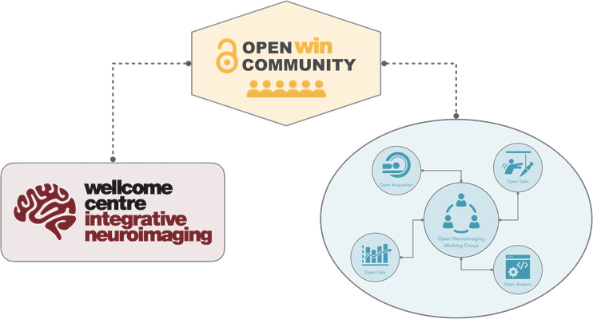

# Who is "The Community?!"
{: .fs-9 }

Find out who is already a member of the Open WIN Community, and where we sit in the wider WIN context.
{: .fs-6 .fw-300 }

---

# Who are we?

We are a community built from around 250 members of the University of Oxford [Wellcome Centre for Integrative Neuroimaging (WIN)](https://www.win.ox.ac.uk). We welcome students, researchers, [core staff](https://www.win.ox.ac.uk/about/core-staff) and faculty, and anyone in between!

We were formed to facilitate the dissemination of knowledge and experience from the developers of the Open WIN Tools into the hands of the WIN Members who will make use of them. In doing so, we are well placed to inform the policy and incentives around the implementation of open research practices at WIN.

Anyone can join and contribute to this community with any level of commitment which is appropriate for them. You are free to dip in-and-out when you have capacity to engage, and you will always be welcomed into the discussion.

## Contributors

Community members who made a contribution to this resource are shown below.

Coming soon
{: .label .label-yellow }

[all-contributors](https://allcontributors.org) plugin to be added

## Community Coordinator - Cassandra Gould van Praag (she/her)

Cass is a postdoctoral researcher with 10 years of neuroimaging (fMRI) research. She was Co-Chair of the [Open Science Room 2020](https://ohbm.github.io/osr2020/), and has been both a participant and speaker at the [Berlin-Oxford Open Science Summer School](https://www.nds.ox.ac.uk/events/oxford-berlin-summer-school-on-open-research-2019), an invited speaker at [Open MR Benelux](https://openmrbenelux.github.io/) and is a Fellow of [Reproducible Research Oxford](https://ox.ukrn.org/). Cass is an active contributor to a number of open community tools, including [Open Research Calendar](https://openresearchcalendar.github.io/Open-Research-Calendar/), the [COBIDAS Checklist](https://github.com/Remi-Gau/COBIDAS_chckls) and [The Turing Way](https://the-turing-way.netlify.com/introduction/introduction)

Email: Cassandra.GoudVanPraag@psych.ox.ac.uk  
GitHub: @cassgvp  
Twitter: @cassgvp

## WIN Open Neuroimaging Working Group

This community feeds directly into the [WIN Open Neuroimaging Project](https://www.win.ox.ac.uk/open-neuroimaging/open-neuroimaging-project) and its working groups listed below along with their leads.

* Open Data [Clare Mackay](https://www.win.ox.ac.uk/people/clare-mackay)
* Open Analysis [Mark Jenkinson](https://www.win.ox.ac.uk/people/mark-jenkinson)
* Open Acquisition [Stuart Clare](https://www.win.ox.ac.uk/people/stuart-clare)
* Open Tasks [Laurence Hunt](https://www.win.ox.ac.uk/people/laurnece-hunt)
