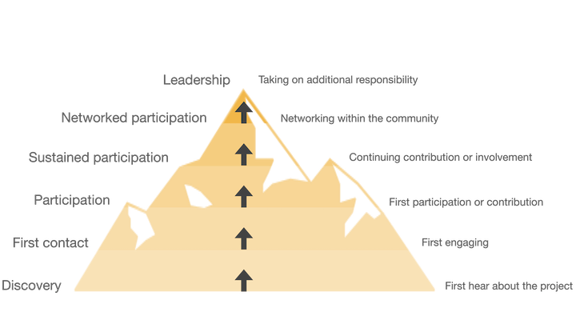

# Mountain of Engagement
{: .fs-9 }

How we aim to work with community members to build growth and a sustainable community
{: .fs-6 .fw-300 }

---

We want this community to grow in reach and ambition. We also want individual members to have to opportunity to direct their own growth and feel ownership of their community. This sense of ownership will build in sustainability, where each individual takes on partial and momentary responsibility for some aspect.

To achieve individual and community growth, we are following the "Mountain of Engagement" model. This is a tool for conceptualising how people will interact with your community, and building an understanding of how different people might grow from their first interaction to taking on some form of responsibility. Not all community members will progress to leadership, but it is useful to think about what actions or events may lead people to progress.  

We have used the Mountain of Engagement model to consider how our imaginary [personas](personas-and-pathways.md) might interact with the Open WIN community. This exercise has provided useful insight into how we can support progression for a variety of people. 
