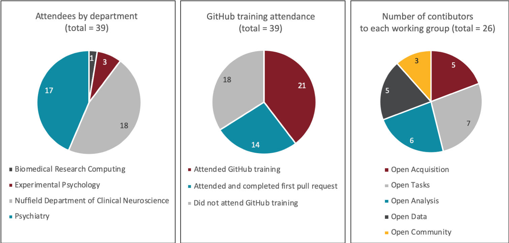

# Community Hack Day #1
{: .fs-9 }

Find out what happened on our first hack day!
{: .fs-6 .fw-300 }

---

**Our first community hack day was held on Monday 19th October 2020.**

## Aims

The aims for the hack day were to:
1. Introduce interested individuals to the community, and communicate how you may benefit from participation, what kind of activities you may be able to take part in, how you will be recognised for your contribution, and what behaviours or commitment may be expected of you.
2. Provide training on how to use the [Open WIN Tools](../tools.md).
3. Provide training on GitHub/GitLab and how it will be used to update this repository.
4. Begin crafting and contributing documentation to share our training with others.

## How did it go?!

The day was structured around “lightning pitches” from the infrastructure developers to advertise where they would benefit from community engagement, followed by training in how to use GitHub to make contributions (submitting a pull request to [an external repository](https://cassgvp.github.io/git-for-collaborative-documentation)), and then three hours of dedicated time to work with the tools developers to make contributions and build ideas for future interactions. Summary attendance and engagement figures from the hack day are provided in below.

{:height="100%" width="100%"}

## What did we achieve?

It was wonderful to see the conversations happening in Wonder for each of the tools working groups. Below is a summary of the activities, achievements and outcomes from the day from each group.

### Open acquisition
- Gave detailed demonstrations to WIN members and gathered user feedback about what features were felt to be particularly useful and what adaptations might be necessary.
- Suggestions to take forward included adding the name of a creator to the protocol and adding “group” ownership of a protocol rather than just an individual.
- Uncovered some minor bugs, and developers continued to work on open issues.
- User feedback made it apparent that people would like to use it as part of their standard workflow. Community contributors really pleased to promote use of the tool and said it was intuitive to use with very little training. Agreed to stay in contact with the developers for further contribution.

### Open tasks
- Curated resources for a repository of “seed tasks”, in which a range of stimulus types, cognitive tasks or trial types could be made available for adaptation by other users. These could be released with good documentation, particularly around how to adapt the task. The group have access to the following task types at the moment:
  * Visual search;
  * Continuous motion evidence integration paradigm;
  * EEG tasks;
  * Facial expression recognition;
  * Time estimation;
  * Pain learning;
  * Value-based choice task with information sampling
- Wrote and merged “how to” documentation to the Open WIN Community repository ([pull request #21](https://github.com/cassgvp/WIN-Open-Neuroimaging-Community/pull/21)), including how to access the tasks repository, tools for writing tasks, where to get advice, and using Pavlovia for online testing.

### Open Analysis
- Talked in general about the way FSL has been developed and licenced, with access to source code available when downloaded but only available on the development repository to WIN members. Discussed possibilities for changing that in the future to make it easier to incorporate community contributions.
- Identified opportunities for cross-over between FSL and OHBA Software Library (OSL, MEG analysis tools) in general linear modelling code base.
- Lots of discussion about fslpy for python based pipelines and analysis scripts. Community member submitted merge request to fslpy library, adding a new wrapper script for calling bash tract-based spatial statistics (tbss) using python.
- Containerising pipelines
  * The FSL and OSL developers have generated options to containerise analysis pipelines. These pipelines allow researchers to base results on specific versions of FSL and specific versions of data.
  * The project could now benefit from real world testing and feedback
  * MEG/EEG and MRI/fMRI researchers should be able to contact Andrew Quinn (MEG) or Matthew Webster (MRI) in order to get started testing this out.
- Providing an easy to use version of the UK Biobank pipeline. Working on merging new features of a simplified front-end script with modifications made in Nottingham.

### Open Data
- Focussed on the basic documentation task - getting started with porting documentation from redmine (where wiki information for the developers has been hosted) and sharing the experience of people who have piloted project
- Documentation to Open WIN Community pages submitted in [pull request #23](https://github.com/cassgvp/WIN-Open-Neuroimaging-Community/pull/23), including how to access the database, information about python libraries available for working with XNAT, information on working with BIDS formatted data in XNAT, what Docker images are available for use directly on the XNAT server and how to enable new containers.

### Open Community
- Added some of the working group members as named collaborators on Open WIN Community repository, to distribute responsibility for updating content.
- Continued 1-2-1 GitHub training, with community member fixing typos ([issue #7](https://github.com/cassgvp/WIN-Open-Neuroimaging-Community/issues/7))
- Closed [issue #5](https://github.com/cassgvp/WIN-Open-Neuroimaging-Community/issues/5) (feedback actions on participation guide) and [issue #19](https://github.com/cassgvp/WIN-Open-Neuroimaging-Community/issues/19) (add direct link to “edit this page on GitHub”).
- Some good conversations about ongoing work as contributors to the community, and hackday-2!

## How do you think it went?
We collated feedback at the end of the session about how the day was run and what we could do to improve the experience.

Key themes were around a positive experience with the [Wonder platform](https://vimeo.com/showcase/7645853/video/472801976), a friendly introduction to GiHub contributions, and being able to work directly with the tools developers.

Things we might look to adjust next time will include using slack for chat rather than the inbuilt Wonder chat function, and adding a bit more structure or a pre-meeting to the hack projects.

It was really nice to see that the whole day was "far easier and less code-heavy than expected!" - hackathons aren't reserved for programmers! - and that the day brought opportunities for the "really missed informal/unstructured chats +3!" ❤️

Massive thank you to everyone who came and contributed!

### A quote from one of the attendees
> "The day was really thoughtfully set up, and more engaging than any other remote event I've attended. I felt very welcomed, and like everyone was supported to get on a level playing field. Having a simple session on using GitHub, guiding me through the basic features and steps to contribute to documentation, was a quick way to suddenly knock down a tonne of barriers - previously, whenever I clicked a link for a cool project or resource and it opened on a GitHub page, I'd feel lost on where to start and quietly close the tab… Feeling confident with those basic skills now makes me feel much more part of the open science community! The day also challenged me to think about how I could use the skills and experience I brought with me to contribute to WIN open science projects, which was initially daunting, but meant that I left feeling like I had made a genuine contribution to a worthwhile resource (helping expand the applicability of guidance on setting up online tasks and studies). Working on these projects in small groups also gave me the opportunity to meet other people from WIN and make some connections. I was already sold on open science, but I now feel skilled up, much more able to contribute and like I'm part of that bigger community - excited to see how things progress!"
