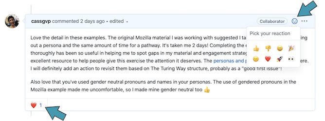

# Using this repository
{: .fs-9 }

How to use and contribute to the community developed resources in this repository
{: .fs-6 .fw-300 }

---

This repository exists to facilitate rapid, user-centred dissemination of information to members of the Open WIN Community and those looking to employ open research practices at WIN.

**Use the sidebar to find essential information on how to cite and contribute to the repository, along with our thanks to those who have helped to develop it.**

# Why are we using Git for creating resources?

This repository and the resources contained within it are built using a [version controlled git repository](https://github.com/cassgvp/WIN-Open-Neuroimaging-Community), rendered into an accessible "book" format.

Using git makes it easy to review and accept contributions from many different people, and flexibly update our resources with a full history of activity.

Working this way also provides an accessible starting point for researchers who are unfamiliar with git to practice contributing to a repository and gain confidence using the git process. Using git is essential in open and reproducible research and an excellent skill to have on your CV.

We are pleased to offer all our contributors training and support in git throughout their engagement with the project.

Don't worry, no one really knows how to use git.1 [https://xkcd.com/1597/](https://xkcd.com/1597/)

1 Of course some people have had a lot of opportunity and need for practice and really do know how to use git. The point is for many of us and our applications, 'simple' git is sufficient and already a big step.

# Providing feedback on this site

This site is for you, so we need to make sure we've got things right!

Providing feedback about this site is a contribution to  the community. Thank you in advance for your contribution! 😃 Any contribution you make will be recorded via GitHub, and we'll make sure you are recognised for it.

**If you're looking for a quick way to contribute (something that will take less than 20 minutes!), please take a look at these ["quick-contribution" issues](https://github.com/cassgvp/WIN-Open-Neuroimaging-Community/labels/quick-contribution). See below for a brief description of what an issue is and how to comment.**

## What is an "issue"
An "issue" is a term used by GitHub for a place to track ideas, enhancements, tasks, or bugs.

You can leave feedback on this site by commenting on the [issues in our github repository](https://github.com/cassgvp/WIN-Open-Neuroimaging-Community/issues?q=is%3Aissue+is%3Aopen+sort%3Acreated-asc).  You are welcome to comment on any issue that feels relevant. If you are new to the community you might like to first have a go with the issues labelled "good first issue".

## Creating a GitHub account to comment
To comment on the issues you will need a GitHub login. If you haven’t got one, it takes two seconds to create one here: https://github.com/join. Accounts are free and you can close them at any time.

## Do I have to write something?
No. If you don't feel like writing out something, you are very welcome to add a quick emoji to something someone else has written. Feedback on other people's feedback is also really helpful!

If you are able to write something, you are welcome to add just a few words, sentences, or paragraphs if you'd like. Whatever works for you is great.

## Will my comments be public?
Yes. We'd really like for all feedback to be public. This will ensure that everything is transparent and well recorded. The aim is to show that community members have had input on these pages, and we’ve listened to and incorporated your feedback.

Please don’t be worried about being critical (if something’s not right, I need to know about it!), but please try to be respectful and courteous, as per the [community participation guidelines](community/CODE_OF_CONDUCT.md).
