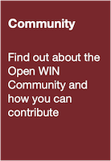

<!--  -->

# Open Research at the Wellcome Centre for Integrative Neuroimaging (WIN)
{: .fs-8 }

Find out how to share your research outputs effectively and responsibly, for improved impact, access and collaboration
{: .fs-6 .fw-300 }

---

Thank you for visiting the WIN Open Neuroimaging Community project repository.

This project is now hosted at https://open.win.ox.ac.uk/pages/open-science/Open-WIN-Community

This repository has been retained to redirect guests to the new home on the Open WIN group above.

Thank you!

<!-- This repository is the hub for information on how to employ open research practices at the [Wellcome Centre for Integrative Neuroimaging (WIN)](https://www.win.ox.ac.uk).

The material shared here is written and maintained by an active community of WIN researchers, and is intended to support all WIN members in using the sharing infrastructure created by the [WIN Open Neuroimaging Project](https://www.win.ox.ac.uk/open-neuroimaging).

**Jump straight into one of the sections below, or use the sidebar to find out more about this repository.**

      

 -->

<!-- [Open WIN Community](docs/community.md){: .btn .btn-primary .fs-6 .mb-4 .mb-md-0 .mr-2 }  
Find out about the Open WIN Community and how you can contribute

[Open WIN Ambassadors](docs/abmassadors.md){: .btn .btn-primary .fs-6 .mb-4 .mb-md-0 .mr-2 }  
Find out about our plans for the Open WIN Ambassadors scheme

[Open WIN Events](docs/events.md){: .btn .btn-primary .fs-6 .mb-4 .mb-md-0 .mr-2 }  
Look about for events relevant to our community! -->
